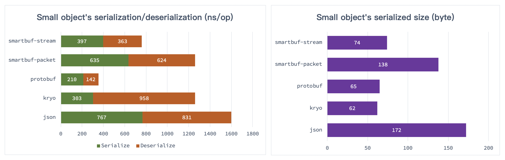
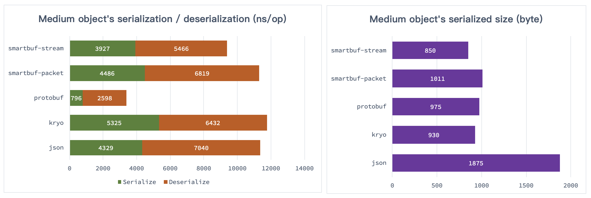
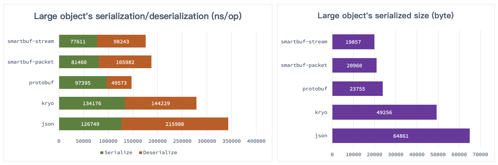

# SmartBuf [](https://travis-ci.org/smartbuf/smartbuf-java) [](https://codecov.io/gh/smartbuf/smartbuf-java)

[中文文档](./doc/index_zh.md)

`smartbuf` is a cross-language serialization and deserialization framework, 
which has high performance and compression ratio like `protobuf`, and has high compatibility and scalability like `json`.

Like `json`, encoded-data generated by `smartbuf` still keeps the `schema` infomation, 
without any pre-defined `IDL`, receiver could decode it directly. 
This feature makes `smartbuf` have better scalability, compatibility and universality.

In order to improve the efficiency of compression and transmission, `smartbuf` uses **Partition Serialization** strategy.
It will split object into multiple different parts, and use different method to encode them. 
About the details, please refer to the following **Partition Serialization** section. 

Because of the well-designed **Partition Serialization** strategy, `smartbuf` provides higher compression ratio and performance.
In my benchmarks, it even could be better than `protobuf`.
For more details, please refer to the following **Benchmark** section.

`smartbuf` also provides two different modes named `packet` and `stream` for different scenes.
For more details, please refer to the following **Usage** section.

# Partition Serialization

In the design concept of `smartbuf`, objects are consists of the following three parts:

+ `property`: it's the underlying property of object's fields, like number, float, string, etc.
+ `struct`: it describes object's structure, includes field-name and fields.
+ `body`：it represents normal object, but all `property` and `struct` are referenced from previous two parts.

For this concept, `smartbuf` creates **Partition Serialization** strategy.
That is, during object encoding process, different parts will be encoded into independent partitions, 
thereby forming multiple compact partitions, and each partition is associated by unique `ID` to complete the assembly of objects.  

## `property` Partition

Property Partition is responsible for storing standard and common values, 
like `const`, `float`, `double`, `varint`, `string`, `symbol`, etc.

It also allocate unique `ID` for those values, in other partitions, only need **1~2** bytes to reference those values. 

In the real world, some properties could be repeated in objects, especially for array or collection.
In this case, if use `json` and `protobuf`, the repeated data will be re-serialized again and again.
But for `smartbuf`, thanks to the partition design, it's unnecessary at all, which could significantly improves space utilization.  

## `struct` Partition

In the design of `smartbuf`, `struct` represents a field-name-list, it doesn't care every field's data type.

Struct Partition contains two parts: `field-name` pool and `struct` pool, the former is similar with `string[]`,
the latter is similar with `int[][]`，which means `int[]` could represents an `struct`, 
and each `int` represents the reference to a field name.

This design has two advantages:

 + **Field Name Reusing**: While encoding, different objects could reuse same field names, especially for common name like `name`, `id`, `timestamp`, `url`, etc.
 + **Context Reusing**：Could easily cache and reuse the global `struct` partition.

In fact, `smartbuf` will keep two `struct` pools inside, namely `temporary` and `context`.
the former used to describe some temporary object like `Map`, and the latter used to describe some reusable object like `POJO`.

This is also the biggest difference between the `packet` and `stream` modes mentioned earlier. 
For `packet` mode, the context concept is disabled, it will treat all objects as `temporary` types.

## Data Partition

Data Partition is mainly the `body`.

As mentioned above, the object's `property` and `struct` have been extracted into seperate partitions.
Therefore, `body` could use very small space to reference `property` and `struct`, thus assembling into a complete object. 

The above rules are mainly for ordinary `object`, and for array there has a special set of processing rules:

 + **Native Array**: Native Array as one special entity, wouldn't be extracted into `property`.
 + **Slice Array**: Some complex `object[]` may contains different data, even `null`, so `smartbuf` will treat one array as multiple slices which has same data type. 

`smartbuf` has a very clever algorithm for the processing of arrays, which can improve the coding space utilization.

## Partition Example

For better understanding of Partition Serialization, 
this section demonstrates the details of the partition encoding described above with a simple object.

This is a simple `User` model:

```proto
message User {
    int32 id = 1;
    string name = 2;
    int64 time = 3;
}
```

For the first time to use `smartbuf` to encode `User{id=1001, name="hello", time=10000L}`, the final output bytecode is as follows:


Because the first output contains `schema` data of `User`, so it appears to be bloated.  

If in `stream` mode to encode it again, some `schema` will be reused, and the final output bytecode is as follows:


In real system development, the data we transformed 

As you can imagine, in actual system development, there are often many repetitive properties inside the data we transmit
 (especially arrays). Serializing these repeated attributes with `smartbuf` often requires only one extra byte.

In addition, as can be seen from this example, even for anyone who does not cache the full context `schema` metadata,
the message can be parsed normally.
Of course, due to the lack of auxiliary field information in the data body, 
the field names `id`, `name`, `time` cannot be parsed normally, and they can only be parsed into meaningless serial numbers.

This feature is very helpful for data readability and debugability. 
You can capture packets through the network, and directly view the encoded data message of `smartbuf`, 
which is very difficult for `protobuf`.

# Usage

By now, `smartbuf` only support `java` language, we are working on its support for `javascript`, `golang`, etc.

You can install `smartbuf` by this maven dependency:

```xml
<dependency>
  <groupId>com.github.smartbuf</groupId>
  <artifactId>smartbuf</artifactId>
  <version>0.1.0</version>
</dependency>
```

As mentioned above, `smartbuf` supports two modes: `packet` and `stream`, 
which are wrapped in `SmartPacket` and `SmartStream` respectively, the following is their usages.

## [`SmartPacket`](https://github.com/smartbuf/smartbuf-java/blob/master/src/main/java/com/github/smartbuf/SmartPacket.java)

`SmartPacket` encapsulates `smartbuf` support for `packet` mode, it's a static utility class, 
which could be used directly without initialization.  

```java
UserModel user = new UserModel(1001, "hello", 10000L);
byte[] bytes = SmartPacket.serialize(user); // serialize or encode
UserModel newUser = SmartPacket.deserialize(bytes, UserModel.class); // deserialize or decode
assert user.equals(newUser); 
```

In `packet` mode, `smartbuf` is very similar with `json`, encoded bytecodes contains the whole `schema` information. 
The only difference is that `smartbuf` has much higher performance and higher compression ratio.

The underlying `encode` and `decode` implementation of `smartbuf` are not thread-safe, 
so `SmartPacket` internally encapsulates a reusable instance via `ThreadLocal`, 
For more details, please refer to its source code.   

## [`SmartStream`](https://github.com/smartbuf/smartbuf-java/blob/master/src/main/java/com/github/smartbuf/SmartStream.java)

`SmartStream` encapsulates the `stream` mode support for `smartbuf`. Before using it, you should construct a new instance manually:

```java
final SmartStream stream = new SmartStream();
UserModel user = new UserModel(1001, "hello", 10000L);
byte[] bytes = stream.serialize(user); // serialize or encode 
UserModel newUser = stream.deserialize(bytes, UserModel.class);  // deserialize or decode
assert user.equals(newUser);
```

In `stream` mode, the context status is very important for `smartbuf`.
The `serialize` will only encode `schema` once, and the `deserialize` will keep the received `schema` for context reusing. 

Remember, `SmartStream` isn't thread-safe, you need to construct a seperate instance for each session `context` or `socket` connection,
and ensure that each bytecode packet is processed through it orderly.  

Discontinuous packet my cause context `schema` confusion. 
To avoid this situation, `serialize` will attach an small sequence number into `stream` packets, 
and `deserialize` will check the `sequence`'s continuity as need.   

## Comparison of `packet` and `stream`

The `packet` mode has a relatively low serialization compression ratio. 
It needs to attach complete metadata information to each data message, 
which is more suitable for a contextless scenario like api request.

The `stream` mode has a higher serialization compression ratio. In most scenarios, it is higher than `protobuf`. 
It needs to maintain the context state at both ends of the data transmission, 
which is more suitable for scenarios like long-connection multiplexing.

# Benchmark

This section is mainly for a comprehensive performance benchmark test for various data scenarios. 
The data magnitude includes `small`, `medium`, `large`, and the comparison tests include:

+ `json`: The technical solution used in the test is `jackson`, which is also the best library for `json` serialization performance in the `java` language.
+ `kryo`: It only supports `java`, including it into the test is only for horizontal comparison.
+ `msgpack`: It's similar to `json`, but it performs poorly in actual tests and only for observational references.
+ `protobuf`: In the following performance test, it is an important challenge for `smartbuf`.

The performance test uses `JMH` technology, which handles `warmup` well, 
and also supports very accurate statistics of various performance indicators. 
The test environment is as follows:

 + JDK 1.8.0_191
 + MacBook Pro (15-inch, 2018)

The source code of this benchmark is [`test`](https://github.com/smartbuf/smartbuf-java/tree/master/src/test/java/com/github/smartbuf/benchmark).
You could `checkout` it and run it locally.
 
## `Small` Object

The first object to be tested is a small `User` instance, which is not the actual data model used in any production environment. 
It is only used to demonstrate the performance of `smartbuf` on minimal object serialization. The specific model is as follows:

```java
public class UserModel {
    private long    id;
    private Boolean blocked;
    private String  nickname;
    private String  portrait;
    private float   score;
    private int     loginTimes;
    private long    createTime;
}
```

The benchmark result is as follows:



Due to the special partition serialization strategy, 
`smartbuf` does not perform as well as `protobuf` when dealing with small objects, 
but it has obvious advantages over `json`.

## `Medium` Object

The next object to be tested is a fragment extracted from our production environment data structure. 
The specific model is as follows:

```java
public class UserModel {
    private long    id;
    private String  nickname;
    private String  portrait;
    private float   score;
    private String  mail;
    private String  mobile;
    private String  token;
    private Integer type;
    private Integer source;
    private Boolean blocked;
    private int     loginTimes;
    private long    updateTime;
    private long    createTime;
    
    private List<Message> msgs;
    private List<Tag>     tags;

    public static class Message {
        private Long   id;
        private Long   from;
        private Long   to;
        private String msg;
        private Long   timestamp;
    }

    public static class Tag {
        private int    code;
        private String name;
    }
}
```

In the test preparation data, several small objects are randomly allocated for `msgs` and `tags` respectively, 
and finally the performance of each serialization framework is as follows:



It can be seen that during the serialization process of this data magnitude, 
`smartbuf` using `stream` mode exceeds `protobuf`, however, due to the pre-compilation of `protobuf`, 
its encoding and decoding performance still has obvious advantages.

## `Large` Object

The previous `small` and `medium` are not the actual data used in any production environment. 
In order to test its performance in the real production environment, this section deliberately took a famous `APP` for testing.

The test data is taken from the `Twitter` web version of the home page sidebar **global trend**, 
which is probably one of the most frequently used interfaces, 
i have organized it into [`json`](https://github.com/smartbuf/smartbuf-java/blob/master/src/test/resources/large.json).
The corresponding `java` model is too large, you can see the source code 
[`TrendModel`](https://github.com/smartbuf/smartbuf-java/blob/master/src/test/java/com/github/smartbuf/benchmark/large/TrendModel.java).

For this test data, the performance of each serialization framework is as follows:



As we can see, the over `64KB` of global trend data, only need `20KB` for `smartbuf` encoding, 
even the `packet` mode is significantly better than `protobuf`.

The encoding performance is also the best of `smartbuf`, but `protobuf` still has a big lead in decoding performance.

# Advantages and disadvantages

From the above examples and tests, 
we can intuitively see that `smartbuf` keeps the `schema` information in the serialization result.
This makes it difficult to take advantage of design when it comes to small data sets, 
especially for test small objects around `100B`.

But for normal data objects, such as the common system data such as `2K`, `20K`, even bigger,
the advantages of the `smartbuf` algorithm design can be fully reflected.
For larger data objects of the array class, the space utilization of `smartbuf` will significantly exceed `protobuf`.

Using `smartbuf` does not need to predefine any `IDL` like `*.proto`, 
it can directly encode the ordinary `POJO` as `byte[]`. 
The whole process is very similar to the commonly used `json` serialization tool.

All in all, using `smartbuf` may bring the following benefits:

## More efficient data transfer

Compared to `json`, it can reduce network resource consumption by even 70%.

Compared to `protobuf`, it can also reduce network resource consumption by over 10%.

For Internet products, especially the mobile Internet that network isn't stable,
it can improve the interface response speed, reduce the power consumption of the device, and improve the system throughput.

## Improve development and debugging flexibility

Compared to `protobuf`, using `smartbuf` no longer requires manual maintenance of `IDL`, 
which is very important for fast iterations of early productions.

Another point that can't be ignored is the impact of `IDL` on the product.
For example, I participated a `Android` application that uses `protobuf`,
with the rapid iteration, the `proto` was frequently modified. 
After the product went online one year later, the `jar` package compiled by `proto` even reached an amazing `3.8MB`, 
but the whole `APP` was less than 12MB.

# Description

Any form of technical discussion, problem feedback, assistance in development, etc. are welcome.

`smartbuf` is a novel technology that is currently only available in a small range.
But every line of code and every logic has been thoroughly tested, 
and the test coverage of `100%` may not be enough to cover all the scenarios in the actual product reference.

If you encounter any problems during the actual using, please submit the `issue` feedback in time, 
we will respond as soon as possible.

# License

Apache-2.0
