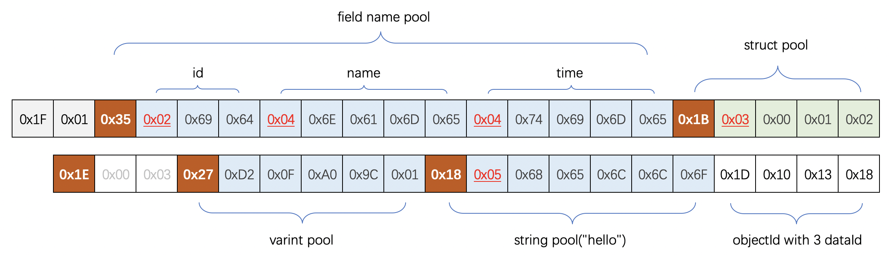
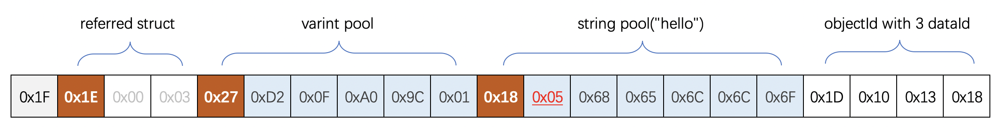

# 介绍

`smartbuf`与`json`、`xml`等数据交换协议类似，在序列化过程中仍然保留着数据的`schema`信息，因此它的易用性、可扩展性、可读性等与`json`类似，
即在数据交换过程中，通讯双方不需要预先协定数据模型，且任意一方都可以按照需要修改数据模型，这一点对于系统迭代更新过程中的向下兼容非常重要。

为提高数据的压缩与传输的效率，`smartbuf`内部采用**分区序列化**的策略，将对象拆分为多个不同的分区，
针对不同的分区按照不同的规则进行序列化，然后各个分区之间通过id引用并组成最终的实体对象。
关于**分区序列化**的技术细节，你可以在接下来的章节中看到。

这种设计策略在确保扩展性、兼容性的同时，也提供了非常高的压缩率和性能，在实际测试中比`protobuf`更高一些。
关于性能测试的具体细节，你可以在接下来的**性能测试**中看到。

`smartbuf`针对不同的业务场景提供两种不同的模式`packet`与`stream`。
`packet`模式的序列化压缩率相对低一些，它需要为每个数据报文附加完整的元数据信息，比较适合用于类似api请求这种无上下文的场景。
`stream`模式的序列化压缩率更高，多数场景下比`protobuf`更高一些，它需要传输数据的两端保持上下文状态，比较适合用于类似长连接多路复用的场景。

# 分区序列化

在smartbuf的设计中，对象可以拆分为三个部分：property、struct、body。

针对这样的设计，序列化过程中也会将不同的部分拆分在不同的分区中，互相之间通过uniqueId引用组成完整的数据。

## `property`池

属性池用于存储一些通用、标准的属性值，包括const、float、double、varint、string、symbol。

所有属性在这个池中都拥有递增且唯一的ID，在body中所有引用这些属性的地方，直接引用ID即可，这个ID往往都很小，只需要1~2byte。

在实际情况下，数据体中的某些属性有可能重复出现，使用JSON和ProtoBuf时候，重复出现的数据会被重复序列化，
但是得益于数据池的设计，smartbuf不需要重复序列化相同的属性。

const是一种特殊的数据，包括null、true、false、empty-string等，这些特殊的数据以常量的方式预定义在协议中。

## `struct`池

结构体不需要考虑其属性的数据类型，它只提供类似于动态语言的弱类型结构体。

结构池内部包括两部分，属性名池与结构体池，属性名池类似于string[]，而结构体池内部通过varuint引用属性名。

这样的设计有两个优点：

1. 不同的结构体可以复用相同的属性名，尤其是常用的属性名如name、id、timestamp、url等。
2. 在长连接通信时，可以将属性名、结构体缓存在context中，避免这些schema信息重复出现在每一个数据报文中，从而提供数据传输效率。

## 数据体

如上文所言，对象的property与struct都已经提取至独立的分区中，因此在body中只需要通过极少的字节数声明对property池与struct池的引用即可。

这些规则主要针对Object，对于数组有一套特殊的处理规则：
1. 原生数组：原生数组作为特殊的实体，并不需要提取至property池，以免property过于臃肿。
2. 数组分片：一个数组可能包含不同的数据类型、甚至null，因此数组需要根据类型按照一定大小的分片序列化。

## 实例演示

为了更清晰地展示`smartbuf`序列化的最终效果，本章节通过一个简单的对象演示上文所述的数据分区的细节。

以下为一个简单的`User`模型数据结构：

```proto
message User {
    int32 id = 1; // 100
    string name = 2; // 10000L
    int64 time = 3; // hello
}
```

首次使用`smartbuf`对此模型的一个实例`User{id=1001, name="hello", time=10000L}`进行序列化时，其最终输出字节码结构如下所示：



上图中的数据中包括了对象结构元数据，所以显得臃肿了一些。

如果在`stream`模式下重复使用该模型的话，由于上下文可以缓存这些元数据，
因此不需要附加这些额外的描述性数据，最终序列化效果如下所示：



你可以想象一下，在实际的系统开发中，我们传输的数据（尤其是数组）内部常常存在许多重复属性，
使用`smartbuf`序列化这些重复属性的话，往往只需要额外的1~2个字节。

除此之外，从这个例子也可以看出，即便是对于没有缓存完整上下文`schema`元数据的任何人，都可以正常解析这个报文。
当然，由于数据体中缺乏辅助性的字段信息，仍不能正常解析`id`, `name`, `time`这些字段名，只能将它们解析为无意义的序号。

这一特点对于某些debug等开发场景很有帮助，你可以通过网络抓包的方式，来直接查看传输的数据报文，这也是protobuf很难做到的。

## 优势与劣势

分区序列化的优势与劣势都是显而易见的

# Usage

By now, `smartbuf` only support java language, you can install it by this maven dependency:

```xml
<dependency>
  <groupId>com.github.sisyphsu</groupId>
  <artifactId>smartbuf</artifactId>
  <version>0.0.1</version>
</dependency>
```

## `packet`与`stream`

# 性能测试

